# Assignment 1 Report

## Sanity Checks
The rimless wheel model was tested to verify the continuous dynamics and the impact/reset behavior. At first, the initial conditions were not generating enough energy to demonstrate the reset code since it stopped at the first spoke. After adjustements, a test case with `N = 6` spokes, a slope of `γ = 10°`, and an initial angular velocity of `2 rad/s` was used to show at least few rotations. 

### Continuous Dynamics Check
During the continuous portion of each step, the rimless wheel follows the inverted pendulum dynamics

$$
\ddot{\theta} = \frac{g}{l}\sin(\theta).
$$

The sign of the angular acceleration was checked at different angles. For `θ < 0`, representing the region where the spoke first contacts the ground to the vertical position, the angular acceleration is negative as expected, meaning the wheel is slowing as it reaches the vertical position. For `θ > 0`, representing the region from the vertical position until the reset when the next spoke contacts the ground, the angular acceleration is positive also as expected, with the wheel accelerating toward the next impact. 

### Reset Dynamics Check
For `N = 6`,

$$
\alpha = \frac{\pi}{N} = 30^\circ.
$$

With `γ = 10°`, the expected impact angle is

$$
\theta^- = \gamma + \alpha = 40^\circ \approx 0.6981 \text{ rad}.
$$

The simulation detected impacts at approximately `0.6981 rad`, consistent with the expected impact condition.

After impact, the stance leg changes and the angle is reset according to

$$
\theta^+ = \gamma - \alpha = -20^\circ \approx -0.3491 \text{ rad}.
$$

The simulation reset the angle to approximately `-0.3491 rad` after each impact.
These angles align with the expected reset positioning given the chosen initial conditions

### Impact Event
The angular velocity after impact is given by

$$
\dot{\theta}^+ = \dot{\theta}^-\cos(2\alpha).
$$

For `N = 6`, `cos(2α) = cos(60°) = 0.5`, so the angular velocity should be reduced by half at each impact. For example, the first simulated impact produced

$$
\dot{\theta}^- = 2.7216 \text{ rad/s}
$$

and

$$
\dot{\theta}^+ = 1.3608 \text{ rad/s},
$$

which agrees with the expected impact relationship.

The simulation also showed that after several impacts the wheel no longer had enough angular velocity to complete another step and began to fall backward, demonstrating that not all initial conditions result in sustained rolling.

## State-Space Plot
The region of attraction was estimated by simulating the rimless wheel over a grid of initial angles and angular velocities. Each initial condition was classified according to whether the wheel converged to sustained rolling or came to a stop. An initial condition was considered a failure if the angular velocity became negative, indicating that the wheel had begun to fall backward rather than continue rolling downhill.

The resulting region of attraction is shown below. The plot demonstrates that sustained rolling depends on both the initial angular position and angular velocity. Initial conditions with certain angular velocities do not provide enough energy for the wheel to pass through the vertical position and continue to the next impact. Other initial conditions converge toward stable rolling.

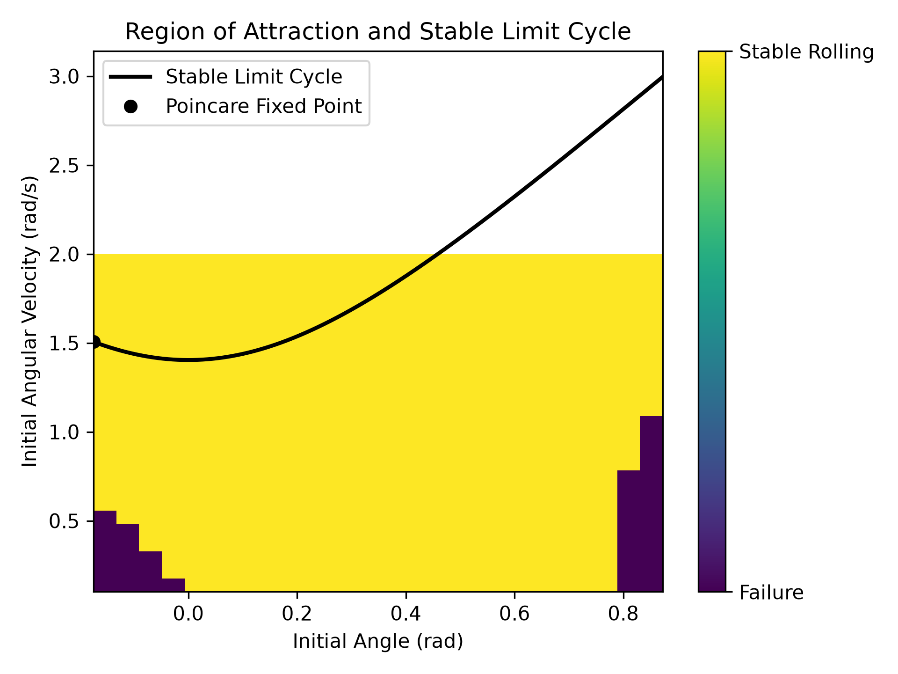

The boundary between successful and unsuccessful initial conditions  represents an estimate of the region of attraction of the rolling motion. The grid of initial conditions plotted give an approximation for which values are within the region of attraction.

## Return-Map Plot
A Poincaré section was defined immediately after each impact. Since the post-impact angle is always reset to

$$
\theta^+ = \gamma - \alpha,
$$

the state on the Poincaré section can be represented using the post-impact angular velocity. The return map relates the angular velocity immediately after one impact to the angular velocity immediately after the following impact,

$$
\dot{\theta}_{k+1}^+ = P(\dot{\theta}_k^+).
$$

The return map for the baseline rimless wheel is shown below along with the identity line,

$$
\dot{\theta}_{k+1}^+ = \dot{\theta}_k^+.
$$

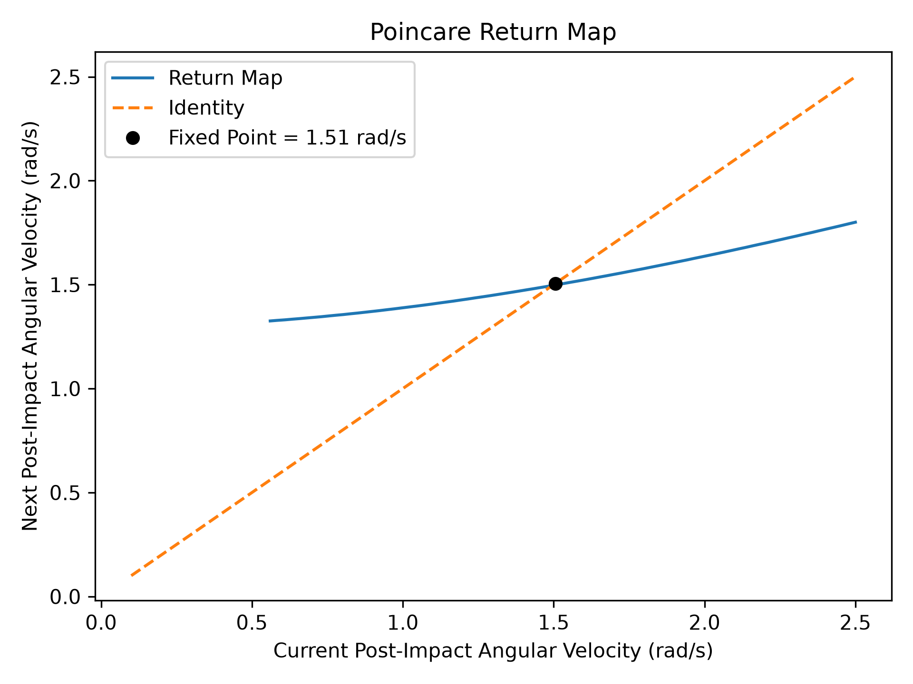

The intersection between the return map and the identity line represents a fixed point of the step-to-step dynamics. For the baseline parameters, the fixed point was estimated to be approximately

$$
\dot{\theta}^{*} \approx 1.5 \text{ rad/s}.
$$

This represents stable rolling because the post-impact angular velocity is approximately the same between steps.

To determine the local stability of this roll, the post-impact angular velocity was perturbed slightly above and below the fixed point. The slope of the return map near the fixed point was approximated using

$$\lambda \approx \frac{P(\dot{\theta}^{*}+\delta)-P(\dot{\theta}^{*}-\delta)}{2\delta}$$

Using a perturbation of $\delta = 0.01\$ rad/s gave a Floquet multiplier of approximately

$$
\lambda \approx 0.25.
$$

Since

$$
|\lambda| < 1,
$$

the rolling is locally stable. The magnitude of the multiplier also shows that perturbations decrease between steps, causing nearby trajectories to converge toward the stable roll.

## Parameter Effects on RoA and Convergence
The effects of changing the ground inclination and the number of spokes were examined by repeating the region-of-attraction and Floquet multiplier calculations over several parameter values.

### Effect of Ground Inclination

The slope angle was varied from $10^\circ\) to \(30^\circ$ while keeping the number of spokes constant. The resulting regions of attraction are shown below.

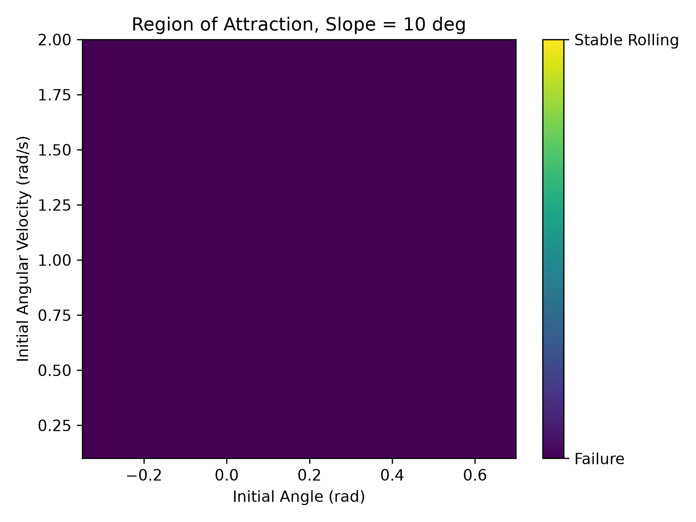

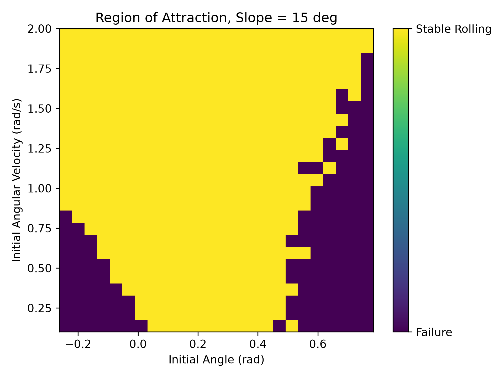

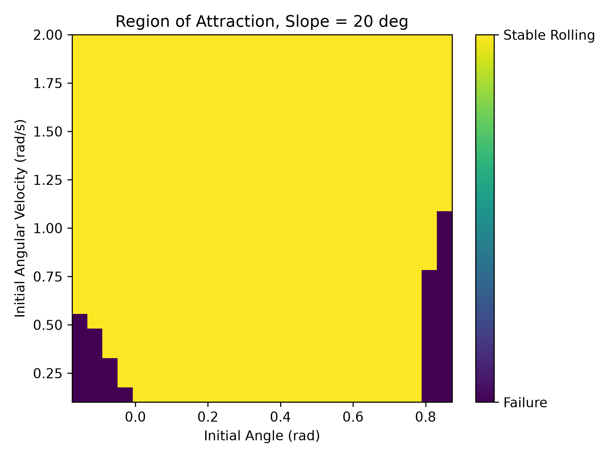

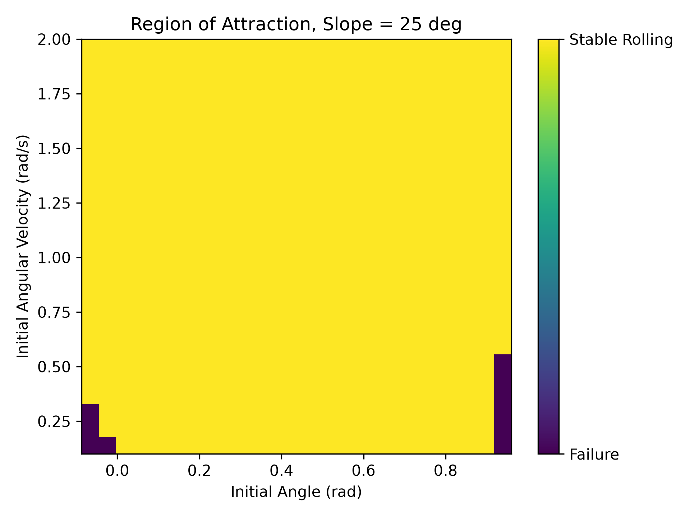

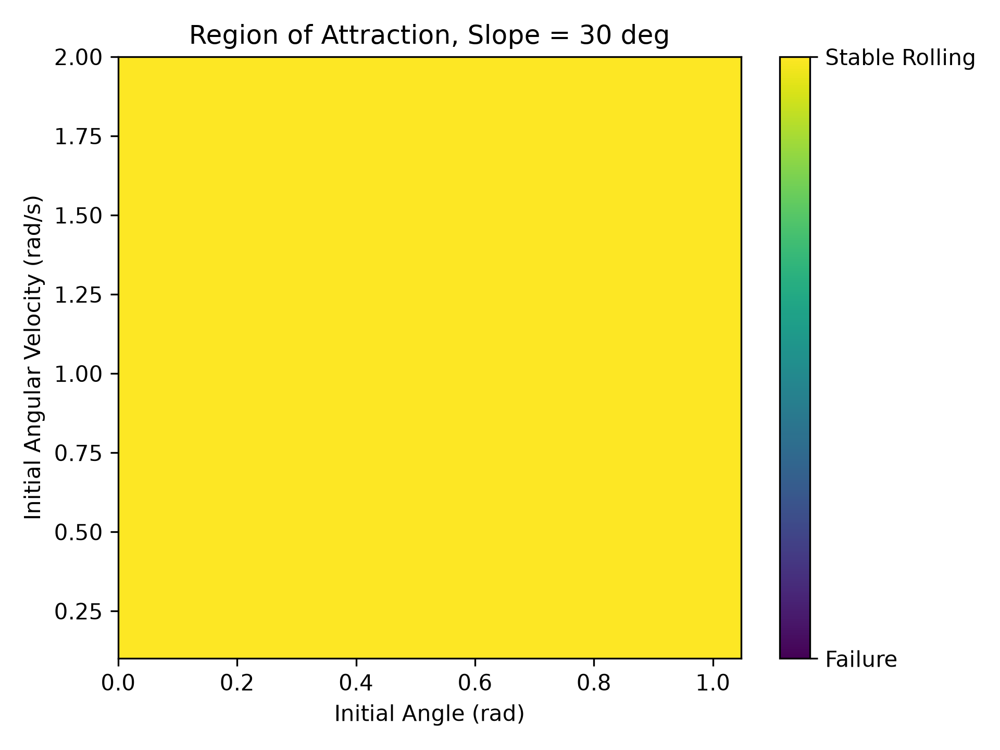

At a slope of $10^\circ$, none of the tested initial conditions converged to a sustained rolling gait. As the slope increased, a stable rolling region appeared and expanded. At $15^\circ$, sustained rolling was possible for a limited range of initial conditions, while the regions of failure became progressively smaller at $20^\circ$ and $25^\circ$. At $30^\circ$, nearly all of the tested initial conditions resulted in sustained rolling.

This trend occurs because increasing the downhill inclination increases the amount of gravitational energy available during each step. The additional energy makes it easier for the wheel to overcome the energy lost during the plastic impact and continue moving into the next step. Therefore, increasing the slope significantly increases the region of attraction of the rolling gait.

The Floquet multiplier was also calculated for each slope where a rolling fixed point existed.

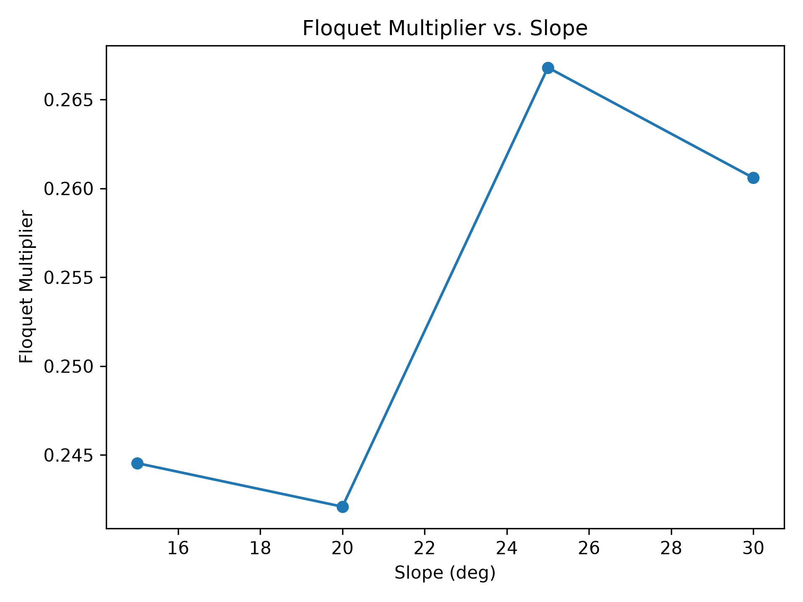

No valid rolling fixed point was found for the $10^\circ$ case. For slopes from $15^\circ$ to $30^\circ$, the Floquet multipliers remained between $0.24$ and $0.27$. Since all of these values are less than one in magnitude, the periodic gaits are locally stable.

Although changing the slope had a large effect on the region of attraction, it had a relatively small effect on the local convergence rate once a continuous roll existed. This shows that the region of attraction describes which initial conditions reach the continuous roll, while the Floquet multiplier describes how nearby trajectories converge once they are close.

### Effect of Number of Spokes

The number of spokes was varied from `N = 6` to `N = 12` while keeping the ground inclination constant. Since

$$
\alpha = \frac{\pi}{N},
$$

increasing the number of spokes decreases the angular spacing between consecutive spokes and therefore changes both the continuous step geometry and the velocity loss at impact.

The regions of attraction for the different spoke counts are shown below.

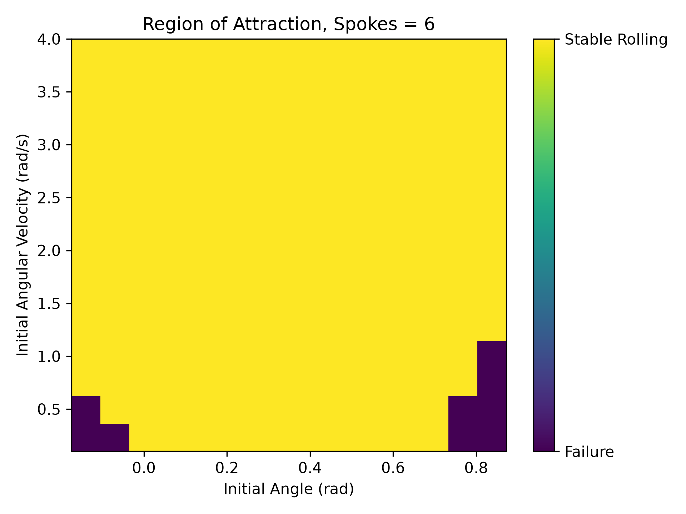

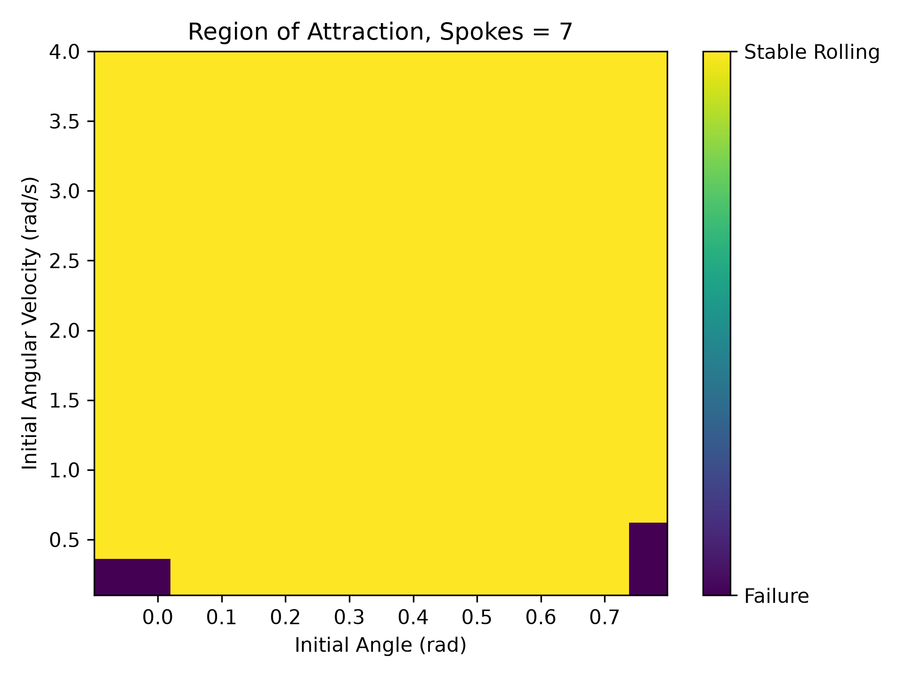

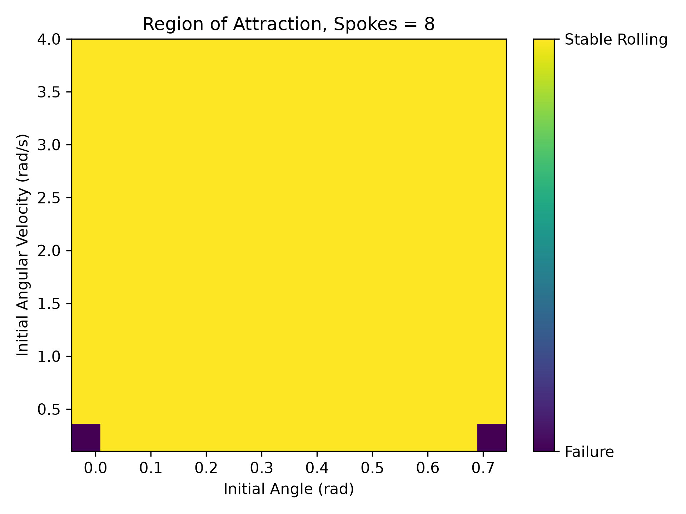

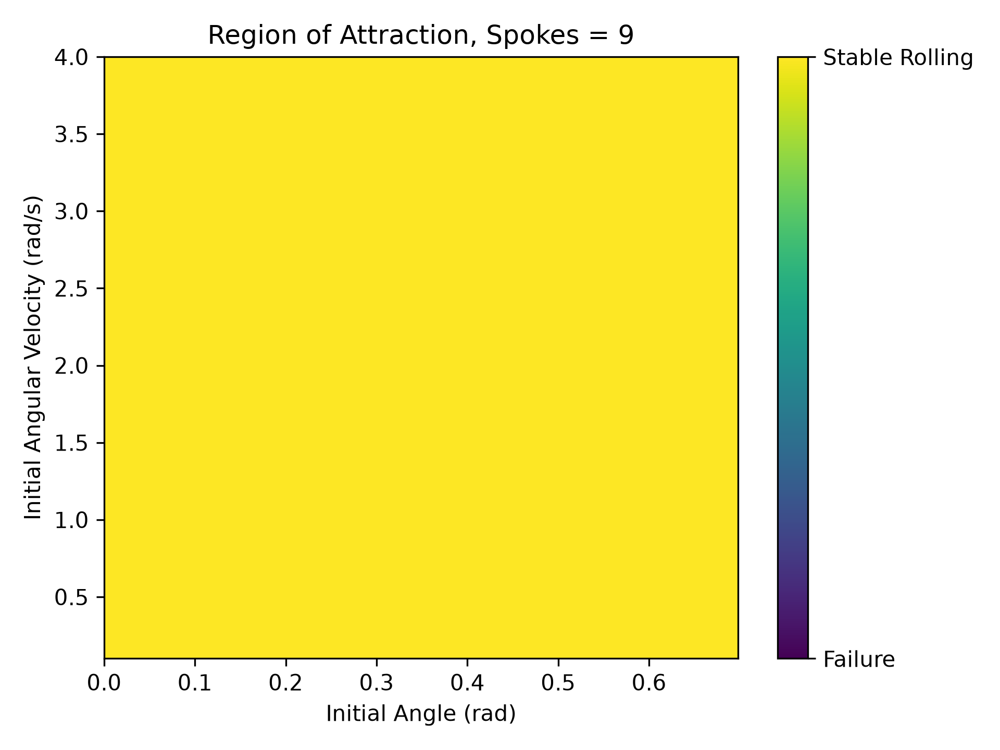

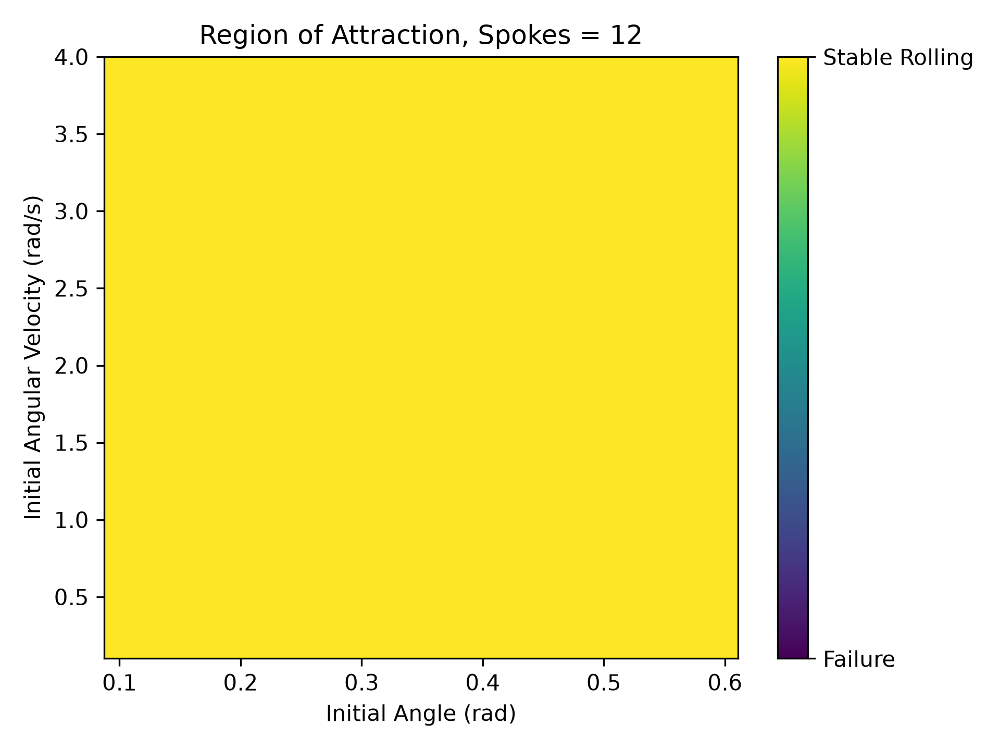

Changing the number of spokes changes the set of initial conditions that can reach the stable rolling gait. As the number of spokes increases, each individual step becomes shorter because $\alpha$ decreases. The impact relationship

$$
\dot{\theta}^+ = \dot{\theta}^-\cos(2\alpha)
$$

also changes. As `N` increases, $\alpha$ decreases and $\cos(2\alpha)$ approaches one, meaning that a smaller fraction of angular velocity is lost at each impact.

The effect of spoke count on the Floquet multiplier is shown below.

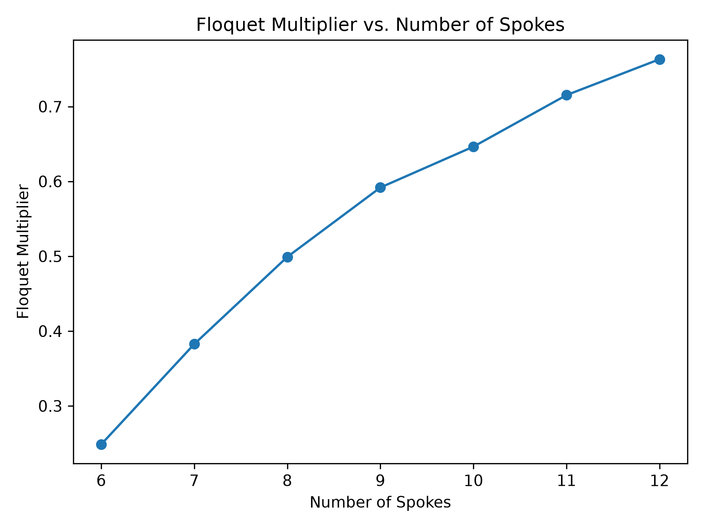

The fixed-point angular velocity increased from about `1.49 rad/s` for six spokes to `3.22 rad/s` for twelve spokes. The Floquet multiplier also increased from about `0.25` to `0.76`. Since all of the multipliers remained below one, the rolling gait was still stable, but the higher values show that the wheel converged more slowly as the number of spokes increased. With more spokes, $\cos(2\alpha)$ is closer to one, so less angular velocity is lost at each impact and disturbances also take longer to die out.
